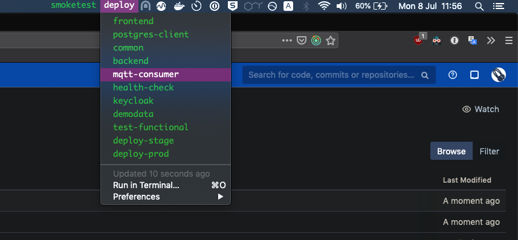

# Bitbar Concourse Pipeline Plugin

# Install

- clone repo
- [install latest BitBar](https://github.com/matryer/bitbar/releases/latest)
- open BitBar and set plugin directory to repo location
- edit the user configuratio in pipeline.30s.sh
- copy pipeline.30s.sh as many times as you want for each pipeline
